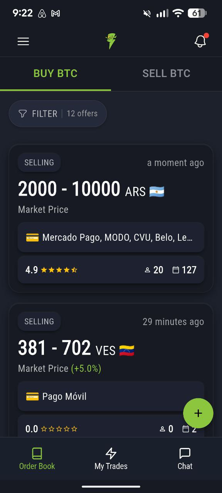
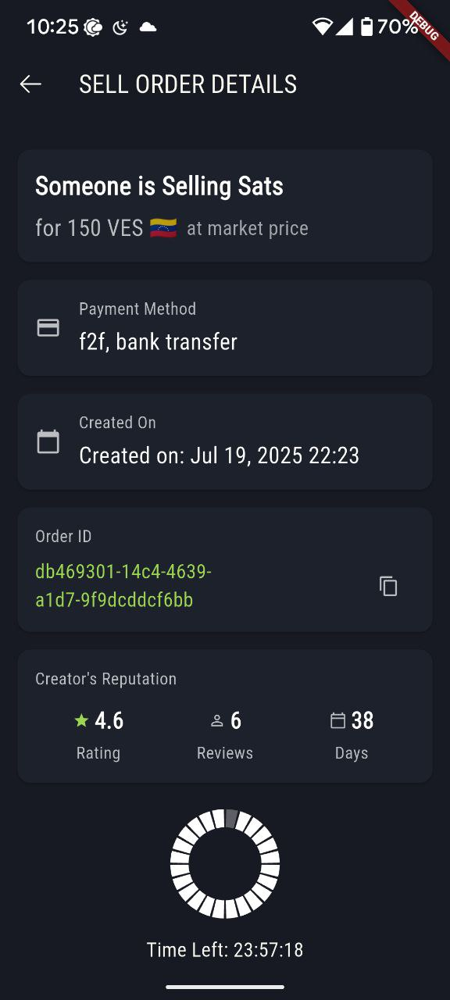
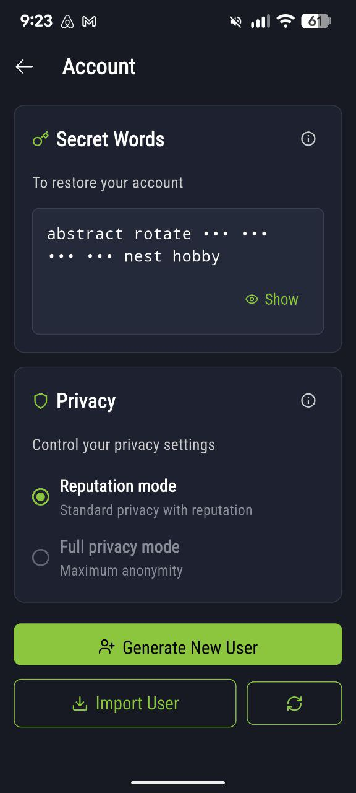
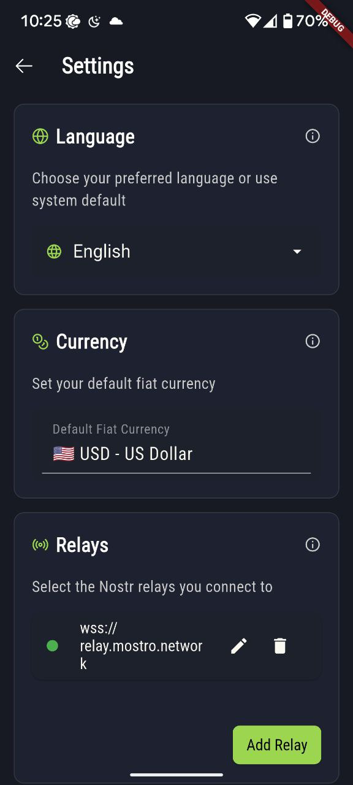
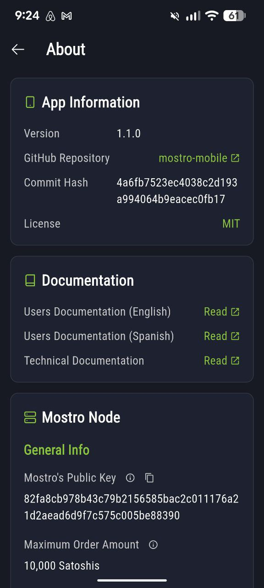

# Mostro Mobile Client

[](https://deepwiki.com/MostroP2P/mobile)   
  *Ask questions about this project using DeepWiki AI*  

A modern, secure mobile client for the [Mostro](https://github.com/MostroP2P/mostro) peer-to-peer Bitcoin trading platform.

This is a fully-featured mobile application that enables secure, private, and decentralized Bitcoin trading over the Lightning Network using the Nostr protocol. Built with Flutter, it provides a native mobile experience for conducting peer-to-peer trades with advanced privacy features and modern UI/UX design.

## 🌟 Key Features

- **🛡️ Privacy-First Architecture**: Advanced encryption with NIP-59 gift wrapping for all trade communications
- **🔑 Hierarchical Key Management**: BIP-32/BIP-39 compliant key derivation with unique keys per trade
- **🌍 Multi-Language Support**: Full internationalization in English, Spanish, and Italian
- **⚡ Lightning Network Integration**: Seamless Bitcoin Lightning payments and invoicing
- **🔄 Real-Time Trading**: Live order book updates and instant messaging with counterparts
- **🎨 Modern UI/UX**: Card-based interfaces, smooth animations, and intuitive navigation
- **🔒 Secure Storage**: Hardware-backed secure storage for cryptographic keys
- **📱 Cross-Platform**: Native performance on both Android and iOS
- **🌐 Decentralized**: No central authority, operates entirely on Nostr relays

## 📱 App Screenshots

<div align="center">

### Main Trading Interface


*The heart of Mostro Mobile - browse available Bitcoin buy/sell orders with real-time updates, filter by currency and payment methods, and start trading with a single tap.*

### Secure Trade Execution  


*Take orders seamlessly with detailed trade information, Lightning invoice handling, and step-by-step guidance through the complete trade process.*

### Account


*You can backup your identity writing down 12 secret words.*

### Modern Settings Interface


*Configure your trading preferences, add relays, customize the interface, and control notifications through the intuitive settings panel.*

### Account & Profile Management


*Check your App and Mostro node settings in about screen.*

</div>

## Prerequisites

### For the Mobile Client

- Install [Flutter](https://flutter.dev/docs/get-started/install): Follow the official guide for your operating system.
- Install [Android Studio](https://developer.android.com/studio) or [Xcode](https://developer.apple.com/xcode/) (for iOS development)
- Install [VS Code](https://code.visualstudio.com/) (optional but recommended)

### For Mostro Daemon

- Install [Rust](https://www.rust-lang.org/tools/install)
- Install [Docker](https://docs.docker.com/get-docker/)

### For Testing Environment

- Install [Polar](https://lightningpolar.com/): For simulating Lightning Network nodes

## Installation

1. Clone the repository:

   ```bash
   git clone https://github.com/MostroP2P/mobile.git
   cd mobile
   ```

2. Install Flutter dependencies:

   ```bash
   flutter pub get
   ```

3. Generate localization and other required files:

   ```bash
   dart run build_runner build -d
   ```

> **Note:**
> These commands generate files needed by `flutter_intl` and any other code generators. You must run them after installing dependencies and whenever you update localization files or code generation sources. If you skip this step, you may encounter missing file errors when running the app.

## Running the App

### On Emulator/Simulator

```bash
flutter run
```

### On Physical Device

Connect your device and run:

```bash
flutter run
```

## Setting up Mostro Daemon

1. Clone the Mostro repository:

   ```bash
   git clone https://github.com/MostroP2P/mostro.git
   cd mostro
   ```

2. Set up the configuration:

   ```bash
   cp settings.tpl.toml settings.toml
   ```

   Edit `settings.toml` with your specific configurations.

3. Initialize the database:

   ```bash
   ./init_db.sh
   ```

4. Run the Mostro daemon:

   ```bash
   cargo run
   ```

See the README.md in the mostro repository for more details.

## Setting up Polar for Testing

1. Launch Polar and create a new Lightning Network.
2. Configure at least one node (e.g., "alice").
3. Copy the necessary connection details (cert file, macaroon file) to your Mostro `settings.toml`.

## Development Workflow

1. Ensure Polar is running with your test Lightning Network.
2. Start the Mostro daemon.
3. Run the Flutter app and connect it to your local Mostro instance.

## 🏗️ Architecture

### Core Technologies
- **Flutter**: Cross-platform mobile framework with native performance
- **Riverpod**: Reactive state management for predictable app behavior
- **Nostr Protocol**: Decentralized communication layer (NIPs 01, 06, 44, 59, 69)
- **Sembast**: Local NoSQL database for data persistence
- **dart_nostr**: Comprehensive Nostr protocol implementation

### Security & Privacy
- **NIP-59 Gift Wrapping**: Three-layer encryption (Rumor → Seal → Wrapper)
- **Hierarchical Deterministic Keys**: BIP-32 key derivation with trade-specific keys
- **Forward Secrecy**: Ephemeral keys for enhanced privacy protection
- **Secure Storage**: Platform-native secure storage for sensitive data
- **Key Rotation**: Automatic rotation prevents transaction linking

### Communication Flow
```
Mobile App ←→ Nostr Relays ←→ Mostro Daemon ←→ Lightning Network
     ↓              ↓              ↓              ↓
  UI Layer    WebSocket Conn.  Order Matching  Bitcoin Payments
```

For detailed technical documentation, see **[docs/architecture/](docs/architecture/)**.

## 🔧 Development Commands

### Essential Commands
```bash
# Install dependencies
flutter pub get

# Generate localization and code files (required after dependency changes)
dart run build_runner build -d

# Run the application
flutter run

# Code analysis and linting
flutter analyze

# Format code
flutter format .

# Run tests
flutter test
flutter test integration_test/
```

### Code Quality
This project maintains **zero Flutter analyze issues** and follows modern Flutter best practices:
- Updated to latest APIs (no deprecated warnings)
- Comprehensive error handling with proper BuildContext usage
- Immutable widgets with const constructors where possible
- Proper async/await patterns with mounted checks

## 🎨 Recent UI/UX Improvements

### Modern Interface Design
- **Card-based Settings**: Clean, organized settings interface with visual hierarchy
- **Enhanced Account Screen**: Streamlined user profile and preferences
- **Currency Integration**: Visual currency flags for international trading
- **Improved Navigation**: Smooth page transitions with consistent routing
- **Better Visual Feedback**: Loading states, error handling, and user confirmations

### Accessibility & Usability
- **Multi-language Support**: Comprehensive localization with proper time formatting
- **Responsive Design**: Optimized layouts for various screen sizes
- **Icon Improvements**: Enhanced notification and app launcher icons
- **Touch Interactions**: Improved button responses and gesture handling

## 📚 Documentation

### User Guides
- **[ADDING_NEW_LANGUAGE.md](docs/ADDING_NEW_LANGUAGE.md)** - Complete localization guide
- **[CLAUDE.md](CLAUDE.md)** - Development environment setup and project conventions

### Technical Documentation
- **[docs/architecture/](docs/architecture/)** - Complete technical documentation and system architecture
- **Code Documentation**: Inline documentation following Dart conventions

## 🚀 Contributing

We welcome contributions of all sizes! Here's how to get started:

### Development Setup
1. Read **[CLAUDE.md](CLAUDE.md)** for project conventions and development commands
2. Ensure `flutter analyze` returns zero issues before submitting
3. Run tests to verify your changes don't break existing functionality
4. Follow existing code patterns and architectural decisions

### Adding New Features
- Study existing features in `lib/features/` for implementation patterns
- Use Riverpod for state management and dependency injection
- Implement proper localization for all user-facing strings
- Add appropriate tests for new functionality

### Language Support
📖 **[ADDING_NEW_LANGUAGE.md](docs/ADDING_NEW_LANGUAGE.md)** - Step-by-step instructions for adding new language support

Currently supported languages:
- **English** (en) - Base language
- **Spanish** (es) - Complete translation
- **Italian** (it) - Complete translation

## License

This project is licensed under the MIT License. See the `LICENSE` file for details.

## ✅ Feature Progress

### 🎯 Core Trading Features
- [x] **Order Management**: Create, display, and manage buy/sell orders
- [x] **Order Execution**: Take orders with full buy/sell flow support
- [x] **Real-Time Updates**: Live order book updates via Nostr subscriptions
- [x] **Lightning Integration**: Lightning address support for seamless payments
- [x] **Trade Lifecycle**: Complete order-to-completion flow management
- [x] **Order Cancellation**: Maker cancellation and cooperative cancellation

### 💬 Communication & Chat
- [x] **Peer-to-Peer Messaging**: Secure direct messaging with trade counterparts
- [x] **Trade Chat**: Integrated chat for each trading session
- [x] **Real-Time Chat**: Live messaging with message delivery confirmation
- [x] **Encrypted Communications**: NIP-59 gift wrapping for all trade messages

### 🔐 Security & Privacy
- [x] **Hierarchical Key Management**: BIP-32/BIP-39 compliant key derivation
- [x] **Trade-Specific Keys**: Unique key pairs for each trading session
- [x] **Secure Storage**: Hardware-backed storage for cryptographic keys
- [x] **Privacy Controls**: Configurable privacy settings and reputation tracking

### 🌐 User Experience
- [x] **Multi-Language Support**: English, Spanish, and Italian localization
- [x] **Modern UI Design**: Card-based interfaces with smooth animations
- [x] **Settings Management**: Comprehensive settings and preferences
- [x] **User Rating System**: Rate counterparts after successful trades
- [x] **Push Notifications**: Real-time trade and message notifications
- [x] **Enhanced Icons**: Improved app launcher and notification icons

### 🛠️ Technical Achievements
- [x] **Zero Analyzer Issues**: Clean codebase following Flutter best practices
- [x] **Modern APIs**: Updated to latest Flutter APIs, no deprecated warnings
- [x] **Comprehensive Testing**: Unit and integration test coverage
- [x] **Code Generation**: Automated localization and mock generation
- [x] **Background Services**: Reliable background processing for notifications

### 🚧 Planned Features
- [x] **Invoice Recovery**: Add new invoice if payment fails
- [x] **Multi-Relay Support**: Advanced relay management and failover
- [ ] **Dispute Resolution**: User-initiated dispute flow
- [ ] **Admin Tools**: Dispute management interface for administrators
- [ ] **Tor Integration**: Anonymous relay connections

### 📊 Platform Status
- ✅ **Android**: Full feature support with native performance
- ✅ **iOS**: Complete iOS implementation with platform-specific optimizations
- ✅ **Security**: Production-ready cryptographic implementation
- ✅ **Localization**: Complete translation coverage for supported languages
- ✅ **Documentation**: Comprehensive technical and user documentation

