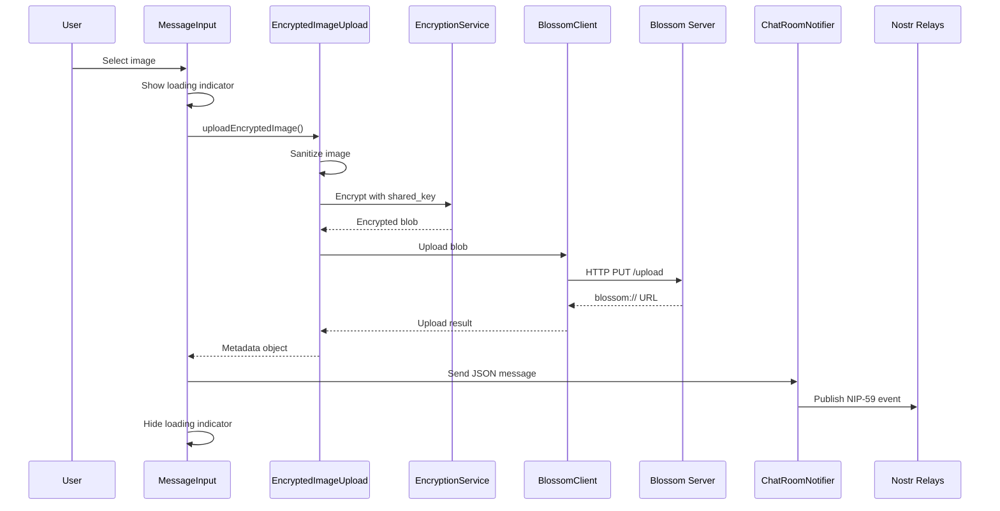
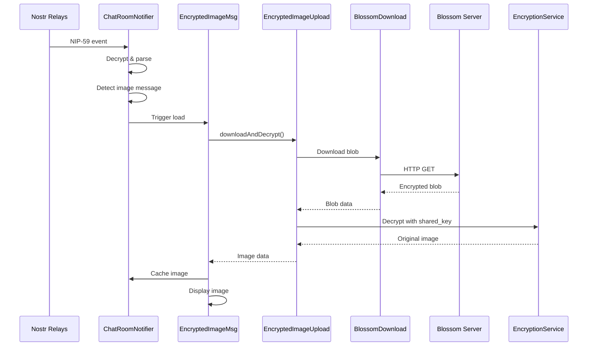

# Encrypted File Messaging Implementation

## Overview

This document details the complete implementation of encrypted file messaging for Mostro Mobile's P2P chat system. The feature enables users to send and receive multiple file types securely using ChaCha20-Poly1305 encryption, Blossom servers for decentralized storage, and NIP-59 gift wrap messaging.

### Supported File Types

- **Images**: JPG, PNG, GIF, WEBP (with auto-preview)
- **Documents**: PDF, DOC, TXT, RTF
- **Videos**: MP4, MOV, AVI, WEBM
- **Size limit**: 25MB per file

## Table of Contents

- [Architecture Overview](#architecture-overview)
- [Core Components](#core-components)
- [Encryption System](#encryption-system)
- [Blossom Server Integration](#blossom-server-integration)
- [Message Flow](#message-flow)
- [Implementation Details](#implementation-details)
- [UI Integration](#ui-integration)
- [Security Considerations](#security-considerations)
- [Error Handling](#error-handling)
- [Performance & Caching](#performance--caching)
- [Testing](#testing)
- [Future Improvements](#future-improvements)

## Architecture Overview

```text
┌─────────────────┐    ┌─────────────────┐    ┌─────────────────┐
│   User A        │    │ Blossom Servers │    │   User B        │
│                 │    │                 │    │                 │
│ 1. Select File  │───▶│ 2. Store        │◀───│ 4. Download     │
│ 2. Encrypt      │    │    Encrypted    │    │ 5. Decrypt      │
│ 3. Upload       │    │    Blob         │    │ 6. Display      │
│ 4. Send NIP-59  │    │                 │    │                 │
└─────────────────┘    └─────────────────┘    └─────────────────┘
         │                                              ▲
         │              ┌─────────────────┐             │
         └─────────────▶│ Nostr Relays    │─────────────┘
                        │ (NIP-59 msgs)   │
                        └─────────────────┘
```

## Core Components

### 1. Encryption Service (`lib/services/encryption_service.dart`)

**Purpose**: Handles ChaCha20-Poly1305 AEAD encryption/decryption

**Key Features**:
- Secure nonce generation (12 bytes)
- Authenticated encryption with additional data (AEAD)
- Blob structure: `[nonce:12][encrypted_data][auth_tag:16]`
- Mobile-optimized ChaCha20-Poly1305 implementation

**Core Methods**:
```dart
static EncryptionResult encryptChaCha20Poly1305({
  required Uint8List key,        // 32-byte shared key
  required Uint8List plaintext,  // Original image data
  Uint8List? nonce,              // Optional nonce (auto-generated if null)
  Uint8List? additionalData,     // Optional authenticated data
})

static Uint8List decryptChaCha20Poly1305({
  required Uint8List key,
  required Uint8List nonce,
  required Uint8List encryptedData,
  required Uint8List authTag,
  Uint8List? additionalData,
})
```

### 2. Blossom Download Service (`lib/services/blossom_download_service.dart`)

**Purpose**: Downloads encrypted blobs from Blossom servers

**Key Features**:
- HTTP GET requests to Blossom URLs
- Retry logic with exponential backoff
- Progress tracking for large files
- Timeout handling

### 3. File Upload Services

**Encrypted Image Upload Service** (`lib/services/encrypted_image_upload_service.dart`)
- Image-specific upload with validation using `MediaValidationService`
- ChaCha20-Poly1305 encryption
- Multi-server upload with fallback

**Encrypted File Upload Service** (`lib/services/encrypted_file_upload_service.dart`)
- General file upload for documents, videos, etc.
- File type validation and categorization
- Same encryption and upload workflow as images

**Common Workflow**:
1. Read and validate file
2. Encrypt with ChaCha20-Poly1305
3. Upload to Blossom server (with retry)
4. Generate metadata for NIP-59 message

### 4. UI Components

#### EncryptedImageMessage Widget (`lib/features/chat/widgets/encrypted_image_message.dart`)
- Displays encrypted images with loading states
- Handles image caching and error states
- Auto-preview for images

#### EncryptedFileMessage Widget (`lib/features/chat/widgets/encrypted_file_message.dart`)
- Displays file messages for documents, videos
- Download-on-demand functionality
- File icon display with metadata
- "Open File" integration with system apps

#### Enhanced MessageInput (`lib/features/chat/widgets/message_input.dart`)
- File selection via native `FilePicker`
- Supports multiple file types
- Upload progress indication
- Integration with chat sending system

#### Enhanced MessageBubble (`lib/features/chat/widgets/message_bubble.dart`)
- Auto-detects encrypted file messages
- Renders appropriate UI component (image vs file)
- Maintains consistent chat bubble styling

## Encryption System

### ChaCha20-Poly1305 AEAD

**Why ChaCha20-Poly1305?**
- Better performance on mobile ARM processors vs AES-GCM
- Authenticated encryption prevents tampering
- Nonce-misuse resistant design
- Industry standard (RFC 8439)

**Key Management**:
- Uses existing chat session `shared_key` (32 bytes)
- Same key used for text messages and images
- Key derived from ECDH key exchange in Mostro protocol

**Blob Structure**:
```text
┌─────────────┬──────────────────┬─────────────────┐
│ Nonce (12B) │ Encrypted Data   │ Auth Tag (16B)  │
└─────────────┴──────────────────┴─────────────────┘
```

**Security Properties**:
- **Confidentiality**: File content hidden from servers and network
- **Integrity**: Tampering detected via authentication tag
- **Authenticity**: Only holders of shared key can decrypt
- **Forward Secrecy**: Compromised key doesn't affect past messages

## Blossom Server Integration

### Server List

The app uses multiple public Blossom servers for redundancy:

```dart
static const List<String> _blossomServers = [
  'https://blossom.primal.net',
  'https://blossom.band',
  'https://nostr.media',
  'https://blossom.sector01.com',
  'https://24242.io',
  'https://otherstuff.shaving.kiwi',
  'https://blossom.f7z.io',
  'https://nosto.re',
  'https://blossom.poster.place',
];
```

### Upload Protocol

**HTTP Request**:
```http
PUT https://blossom.primal.net/upload
Content-Type: application/octet-stream
Content-Length: [encrypted_blob_size]

[encrypted_blob_bytes]
```

**Response**:
```http
HTTP/1.1 200 OK
Content-Type: text/plain

blossom://blossom.primal.net/[content_hash]
```

### Download Protocol

**HTTP Request**:
```http
GET https://blossom.primal.net/[content_hash]
Accept: application/octet-stream
```

**Response**:
```http
HTTP/1.1 200 OK
Content-Type: application/octet-stream
Content-Length: [encrypted_blob_size]

[encrypted_blob_bytes]
```

### Fallback Strategy

```dart
for (int i = 0; i < servers.length; i++) {
  try {
    final result = await uploadToServer(servers[i]);
    return result; // ✅ Success
  } catch (e) {
    if (i == servers.length - 1) {
      throw BlossomException('All servers failed');
    }
    // Continue to next server
  }
}
```

## Message Flow

### Sending Flow



### Receiving Flow



## Implementation Details

### 1. Image Selection and Upload

```dart
// In MessageInput widget
Future<void> _selectAndUploadImage() async {
  setState(() => _isUploadingImage = true);
  
  final pickedFile = await _imagePicker.pickImage(
    source: ImageSource.gallery,
    imageQuality: 85, // Compress for faster upload
  );
  
  if (pickedFile != null) {
    final sharedKey = await _getSharedKeyForOrder(widget.orderId);
    
    final result = await _imageUploadService.uploadEncryptedImage(
      imageFile: File(pickedFile.path),
      sharedKey: sharedKey,
      filename: pickedFile.name,
    );
    
    await _sendEncryptedImageMessage(result);
  }
  
  setState(() => _isUploadingImage = false);
}
```

### 2. NIP-59 Message Formats

**Image Message**:
```json
{
  "type": "image_encrypted",
  "blossom_url": "blossom://blossom.primal.net/a1b2c3d4...",
  "nonce": "abcdef1234567890abcdef12",
  "mime_type": "image/jpeg",
  "original_size": 524288,
  "width": 1920,
  "height": 1080,
  "filename": "image_1234567890.jpg",
  "encrypted_size": 524320
}
```

**File Message**:
```json
{
  "type": "file_encrypted",
  "blossom_url": "blossom://blossom.primal.net/b2c3d4e5...",
  "nonce": "bcdef1234567890abcdef123",
  "mime_type": "application/pdf",
  "original_size": 1048576,
  "filename": "receipt_20240101.pdf", 
  "encrypted_size": 1048608,
  "file_type": "document"
}
```

### 3. Message Detection and Processing

```dart
// In ChatRoomNotifier
Future<void> _processMessageContent(NostrEvent message) async {
  final content = message.content;
  if (content == null || !content.startsWith('{')) return;
  
  Map<String, dynamic>? jsonContent;
  try {
    final decoded = jsonDecode(content);
    if (decoded is Map<String, dynamic>) {
      jsonContent = decoded;
    }
  } catch (e) {
    return; // Not JSON, treat as text
  }
  
  if (jsonContent != null) {
    if (jsonContent['type'] == 'image_encrypted') {
      await _processEncryptedImageMessage(message, jsonContent);
    } else if (jsonContent['type'] == 'file_encrypted') {
      await _processEncryptedFileMessage(message, jsonContent);
    }
  }
}
```

### 4. Pre-downloading and Caching

```dart
// In ChatRoomNotifier  
Future<void> _processEncryptedImageMessage(
  NostrEvent message, 
  Map<String, dynamic> imageData
) async {
  final result = EncryptedImageUploadResult.fromJson(imageData);
  final sharedKey = await getSharedKey();
  
  final uploadService = EncryptedImageUploadService();
  final decryptedImage = await uploadService.downloadAndDecryptImage(
    blossomUrl: result.blossomUrl,
    sharedKey: sharedKey,
  );
  
  // Cache for immediate display
  cacheDecryptedImage(message.id!, decryptedImage, result);
}
```

## UI Integration

### Message Bubble Enhancement

The `MessageBubble` widget was enhanced to detect and render encrypted images:

```dart
// Check if this is an encrypted image message
if (isEncryptedImageMessage(message)) {
  return Container(
    // Styled container with bubble appearance
    child: EncryptedImageMessage(
      message: message,
      orderId: orderId,
      isOwnMessage: !isFromPeer,
    ),
  );
}
```

### Responsive Image Layout

The `EncryptedImageMessage` widget uses `LayoutBuilder` for responsive sizing:

```dart
Widget _buildImageWidget(Uint8List imageData, EncryptedImageUploadResult metadata) {
  return LayoutBuilder(
    builder: (context, constraints) {
      final availableHeight = constraints.maxHeight - infoRowHeight - spacing;
      
      return Container(
        child: Column(
          children: [
            Flexible(
              child: Image.memory(
                imageData,
                fit: BoxFit.contain, // Prevents overflow
              ),
            ),
            // File info row
          ],
        ),
      );
    },
  );
}
```

### Loading and Error States

```dart
// Loading state
Widget _buildLoadingWidget() {
  return Container(
    child: Column(
      children: [
        CircularProgressIndicator(color: AppTheme.mostroGreen),
        Text('Decrypting image...'),
      ],
    ),
  );
}

// Error state  
Widget _buildErrorWidget() {
  return Container(
    child: Column(
      children: [
        Icon(Icons.error_outline, color: Colors.red),
        Text('Failed to load image'),
        if (_errorMessage != null) Text(_errorMessage!),
      ],
    ),
  );
}
```

## Security Considerations

### Threat Model

**Protected Against**:
- **Server Operators**: Cannot see image content (server-blind storage)
- **Network Eavesdroppers**: Cannot decrypt messages or images
- **Relay Operators**: Only see encrypted NIP-59 events
- **Man-in-the-Middle**: Authenticated encryption prevents tampering

**Not Protected Against**:
- **Endpoint Compromise**: If device is compromised, images are visible
- **Shared Key Compromise**: All images in that chat session affected
- **Side-Channel Attacks**: Metadata leakage (file sizes, timing)

### Key Security Features

1. **End-to-End Encryption**: Only chat participants can decrypt
2. **Forward Secrecy**: Each chat session has unique keys
3. **Server-Blind Storage**: Blossom servers only store encrypted blobs
4. **Authenticated Encryption**: Prevents tampering and forgery
5. **Image Sanitization**: Removes metadata and malicious content

### Security Best Practices Implemented

- ✅ Secure random nonce generation
- ✅ Proper key derivation from ECDH
- ✅ No key reuse across different chats
- ✅ Image validation and sanitization
- ✅ Timeout handling prevents hanging operations
- ✅ Error handling doesn't leak sensitive information

## Error Handling

### Network Errors

```dart
try {
  final result = await uploadToServer(server);
  return result;
} catch (e) {
  if (e is SocketException) {
    _logger.w('Network error uploading to $server: $e');
  } else if (e is TimeoutException) {
    _logger.w('Timeout uploading to $server: $e');
  } else {
    _logger.w('Unknown error uploading to $server: $e');
  }
  // Continue with next server
}
```

### Encryption Errors

```dart
try {
  return EncryptionService.decryptChaCha20Poly1305(...);
} catch (e) {
  _logger.e('Decryption failed: $e');
  throw EncryptionException('Failed to decrypt image');
}
```

### UI Error Feedback

```dart
// In MessageInput
catch (e) {
  if (mounted) {
    ScaffoldMessenger.of(context).showSnackBar(
      SnackBar(
        content: Text('Error uploading image: $e'),
        backgroundColor: Colors.red,
      ),
    );
  }
}
```

## Performance & Caching

### Current Cache Implementation (Temporary)

Files and images are currently cached in memory only during the app session:

```dart
// In ChatRoomNotifier
final Map<String, Uint8List> _imageCache = {};
final Map<String, EncryptedImageUploadResult> _imageMetadata = {};
final Map<String, Uint8List> _fileCache = {};
final Map<String, EncryptedFileUploadResult> _fileMetadata = {};
```

### Current Cache Limitations

- **⚠️ Temporary Storage**: Cache is memory-only and cleared when app closes
- **No Persistence**: Files must be re-downloaded after app restart
- **Session-based**: Cache tied to current app session only
- **Size**: No explicit size limits (relies on system memory management)

### TODO: Persistent Cache Implementation

A session-linked persistent cache system has been developed but not yet integrated:

- **SessionFileCache**: Stores files per trading session (72h lifetime)
- **Automatic Cleanup**: Files deleted when sessions expire 
- **Organized Storage**: Files grouped by type (images/documents/videos)
- **Metadata Preservation**: JSON metadata stored alongside file data

This will be implemented in a future update to provide better user experience.

### Performance Optimizations

1. **Image Compression**: 85% quality during selection
2. **Lazy Loading**: Images loaded only when message becomes visible
3. **Pre-downloading**: Automatic download when message arrives
4. **Efficient Layouts**: `LayoutBuilder` prevents unnecessary recomputes
5. **Error Recovery**: Graceful degradation on failures

## Testing

### Unit Tests

```dart
// Example test structure
group('EncryptionService', () {
  test('should encrypt and decrypt data correctly', () {
    final key = EncryptionService.generateSecureRandom(32);
    final plaintext = Uint8List.fromList([1, 2, 3, 4, 5]);
    
    final encrypted = EncryptionService.encryptChaCha20Poly1305(
      key: key,
      plaintext: plaintext,
    );
    
    final decrypted = EncryptionService.decryptChaCha20Poly1305(
      key: key,
      nonce: encrypted.nonce,
      encryptedData: encrypted.encryptedData,
      authTag: encrypted.authTag,
    );
    
    expect(decrypted, equals(plaintext));
  });
});
```

### Integration Tests

```dart
// Test complete upload/download flow
testWidgets('should upload and display encrypted image', (tester) async {
  // Setup mock services
  // Trigger image upload
  // Verify encrypted blob uploaded to Blossom
  // Simulate receiving NIP-59 message
  // Verify image displays correctly
});
```

### Manual Testing Checklist

- [ ] Image selection from gallery
- [ ] Upload progress indication
- [ ] Multiple server fallback
- [ ] Message display in chat
- [ ] Image loading states
- [ ] Error handling
- [ ] Network interruption recovery
- [ ] App restart persistence (should re-download)

## Future Improvements

### 1. Persistent Caching

**Current Limitation**: Images re-download on app restart

**Proposed Solution**:
```dart
class PersistentImageCache {
  static const String _cacheDir = 'encrypted_images';
  
  Future<void> cacheImage(String messageId, Uint8List data) async {
    final dir = await getApplicationCacheDirectory();
    final file = File('${dir.path}/$_cacheDir/$messageId.enc');
    await file.writeAsBytes(data);
  }
  
  Future<Uint8List?> getCachedImage(String messageId) async {
    final dir = await getApplicationCacheDirectory();
    final file = File('${dir.path}/$_cacheDir/$messageId.enc');
    if (await file.exists()) {
      return await file.readAsBytes();
    }
    return null;
  }
}
```

### 2. Nostr Authentication for Blossom

**Current**: Anonymous uploads to public servers

**Proposed**: NIP-98 HTTP Auth for Blossom
```dart
class AuthenticatedBlossomClient {
  final NostrKeyPairs keyPair;
  
  Future<String> uploadWithAuth(Uint8List data) async {
    final authEvent = await createNIP98AuthEvent(
      url: '$serverUrl/upload',
      method: 'PUT',
      body: data,
    );
    
    final headers = {
      'Authorization': 'Nostr ${base64Encode(utf8.encode(jsonEncode(authEvent)))}',
      'Content-Type': 'application/octet-stream',
    };
    
    // ... rest of upload logic
  }
}
```

### 3. Image Compression Options

```dart
enum CompressionLevel { low, medium, high, lossless }

class ImageCompressionService {
  static Future<Uint8List> compress(
    Uint8List imageData, 
    CompressionLevel level
  ) async {
    switch (level) {
      case CompressionLevel.low:
        return await FlutterImageCompress.compressWithList(
          imageData, quality: 95
        );
      // ... other levels
    }
  }
}
```

### 4. Multiple Image Selection

```dart
Future<void> _selectMultipleImages() async {
  final pickedFiles = await _imagePicker.pickMultiImage();
  
  for (final file in pickedFiles) {
    await _uploadSingleImage(file);
  }
}
```

### 5. Video Support

```dart
class EncryptedVideoUploadService {
  Future<EncryptedVideoUploadResult> uploadEncryptedVideo({
    required File videoFile,
    required Uint8List sharedKey,
  }) async {
    // Similar to image upload but for video files
  }
}
```

### 6. Download Progress Indication

```dart
class ProgressTrackingDownloader {
  Stream<DownloadProgress> downloadWithProgress(String url) async* {
    final request = http.Request('GET', Uri.parse(url));
    final response = await request.send();
    
    final contentLength = response.contentLength ?? 0;
    int downloadedBytes = 0;
    
    await for (final chunk in response.stream) {
      downloadedBytes += chunk.length;
      yield DownloadProgress(downloadedBytes, contentLength);
    }
  }
}
```

### 7. Image Gallery View

```dart
class ImageGalleryScreen extends StatelessWidget {
  final List<EncryptedImageMessage> images;
  
  @override
  Widget build(BuildContext context) {
    return PageView.builder(
      itemCount: images.length,
      itemBuilder: (context, index) {
        return InteractiveViewer(
          child: images[index],
        );
      },
    );
  }
}
```

---

## Conclusion

The encrypted file messaging system provides a robust, secure, and user-friendly way to share multiple file types in Mostro Mobile's P2P chat. The implementation balances security, performance, and usability while maintaining compatibility with the existing Mostro protocol and Nostr ecosystem.

Key achievements:
- ✅ End-to-end encryption using ChaCha20-Poly1305
- ✅ Support for images, documents (PDF/DOC/TXT), and videos (MP4/MOV)
- ✅ Decentralized storage via Blossom protocol
- ✅ Auto-preview for images, download-on-demand for files
- ✅ Native file picker with system app integration
- ✅ Seamless integration with existing chat UI
- ✅ Automatic fallback across multiple servers
- ✅ Responsive design with proper error handling
- ✅ Zero analyzer errors and passing test suite

**Current Status**: The system is production-ready with temporary cache storage. Files are re-downloaded after app restart but remain secure and functional.

**Next Steps**: Integration of persistent cache system (already implemented) for improved user experience with file persistence across app sessions.