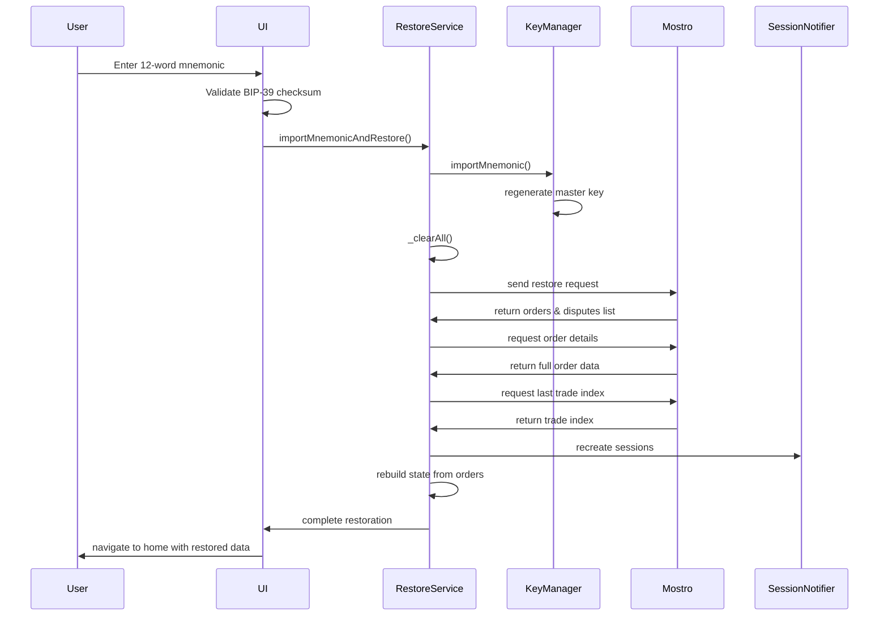

# Session Recovery Architecture

## Table of Contents

1. [Overview](#overview)
2. [Core Components](#core-components)
3. [Recovery Process Flow](#recovery-process-flow)
4. [Key Management](#key-management)
5. [Protocol Communication](#protocol-communication)
6. [State Reconstruction](#state-reconstruction)
7. [Security Considerations](#security-considerations)
8. [Error Handling](#error-handling)
9. [Implementation Details](#implementation-details)
10. [Testing and Validation](#testing-and-validation)

## Overview

The Session Recovery Architecture enables users to restore their complete trading state from a 12-word BIP-39 mnemonic seed phrase. This system recovers not only cryptographic keys but also active trading sessions, order history, and dispute information from the Mostro backend.

### Key Features

- **Complete State Recovery**: Restores all active orders, disputes, and trading sessions
- **Cryptographic Security**: Uses BIP-39/BIP-32 standards for key derivation
- **Trade Index Synchronization**: Maintains exact key sequence consistency
- **Privacy Mode Support**: Recovery is supported in reputation mode only. Privacy mode is not supported because Mostrod cannot link order history requests to a user (this is the intended behavior)
- **Atomic Operations**: All-or-nothing recovery with proper cleanup

## Core Components

### 1. RestoreService

**Location**: `lib/features/restore/restore_manager.dart`

The central orchestrator that manages the complete recovery workflow:

```dart
class RestoreService {
  final Ref ref;
  final Logger _logger = Logger();
  StreamSubscription<NostrEvent>? _tempSubscription;
  Completer<NostrEvent>? _currentCompleter;
  RestoreStage _currentStage = RestoreStage.gettingRestoreData;
  NostrKeyPairs? _tempTradeKey;
  NostrKeyPairs? _masterKey;
}
```

**Key Methods**:
- `importMnemonicAndRestore()`: Main entry point for recovery process
- `initRestoreProcess()`: Orchestrates the 4-stage recovery workflow
- `_clearAll()`: Comprehensive data cleanup before restoration

### 2. KeyManager Integration

**Location**: `lib/features/key_manager/key_manager.dart`

Handles mnemonic import and key regeneration:

```dart
Future<void> importMnemonic(String mnemonic) async {
  await generateAndStoreMasterKeyFromMnemonic(mnemonic);
}

Future<void> generateAndStoreMasterKeyFromMnemonic(String mnemonic) async {
  final masterKeyHex = _derivator.extendedKeyFromMnemonic(mnemonic);
  await _storage.clear();
  await _storage.storeMnemonic(mnemonic);
  await _storage.storeMasterKey(masterKeyHex);
  await setCurrentKeyIndex(1);
  masterKeyPair = await _getMasterKey();
  tradeKeyIndex = await getCurrentKeyIndex();
}
```

### 3. Mnemonic Validation

**Location**: `lib/shared/utils/mnemonic_validator.dart`

Provides BIP-39 checksum validation:

```dart
bool validateMnemonic(String mnemonic) {
  try {
    final trimmed = mnemonic.trim();
    if (trimmed.isEmpty) return false;
    return bip39.validateMnemonic(trimmed);
  } catch (e) {
    return false;
  }
}
```

### 4. Session Reconstruction

**Location**: `lib/shared/notifiers/session_notifier.dart`

Manages session recreation with proper metadata:

```dart
Future<void> saveSession(Session session) async {
  _sessions[session.orderId!] = session;
  _requestIdToSession.removeWhere((_, value) => identical(value, session));
  _pendingChildSessions.remove(session.tradeKey.public);
  await _storage.putSession(session);
  _emitState();
}
```

## Recovery Process Flow

### Stage 1: Mnemonic Import and Cleanup

**File**: `lib/features/restore/restore_manager.dart:57-74`

1. **Mnemonic Validation**: BIP-39 checksum verification
2. **Key Regeneration**: Import mnemonic and regenerate master key
3. **Provider Invalidation**: Force fresh initialization of all providers
4. **Data Cleanup**: Clear all existing local data

```dart
Future<void> importMnemonicAndRestore(String mnemonic) async {
  _logger.i('Restore: importing mnemonic');
  
  final keyManager = ref.read(keyManagerProvider);
  await keyManager.importMnemonic(mnemonic);
  _logger.i('Restore: mnemonic imported and saved to storage');

  ref.invalidate(keyManagerProvider);
  final newKeyManager = ref.read(keyManagerProvider);
  await newKeyManager.init();

  await initRestoreProcess();
}
```

### Stage 2: Temporary Subscription Setup

**File**: `lib/features/restore/restore_manager.dart:116-141`

Creates a temporary subscription using trade key index 1 to receive Mostro responses:

```dart
Future<StreamSubscription<NostrEvent>> _createTempSubscription() async {
  if (_tempTradeKey == null) {
    throw Exception('Temp trade key not initialized');
  }

  final filter = NostrFilter(
    kinds: [1059],
    p: [_tempTradeKey!.public],
    limit: 0, // No historical events, only new ones
  );

  final request = NostrRequest(filters: [filter]);
  final stream = ref.read(nostrServiceProvider).subscribeToEvents(request);
  
  return stream.listen(_handleTempSubscriptionsResponse);
}
```

### Stage 3: Data Request Sequence

The recovery process follows a structured request sequence:

#### 3.1 Restore Data Request

**File**: `lib/features/restore/restore_manager.dart:143-167`

```dart
Future<void> _sendRestoreRequest() async {
  final mostroMessage = MostroMessage<EmptyPayload>(
    action: Action.restore,
    payload: EmptyPayload(),
  );

  final wrappedEvent = await mostroMessage.wrap(
    tradeKey: _tempTradeKey!,
    recipientPubKey: settings.mostroPublicKey,
    masterKey: settings.fullPrivacyMode ? null : _masterKey
  );

  await ref.read(nostrServiceProvider).publishEvent(wrappedEvent);
}
```

#### 3.2 Order Details Request

**File**: `lib/features/restore/restore_manager.dart:231-255`

```dart
Future<void> _sendOrdersDetailsRequest(List<String> orderIds) async {
  final mostroMessage = MostroMessage<OrdersPayload>(
    action: Action.orders,
    requestId: DateTime.now().millisecondsSinceEpoch,
    payload: OrdersPayload(ids: orderIds),
  );

  final wrappedEvent = await mostroMessage.wrap(
    tradeKey: _tempTradeKey!,
    recipientPubKey: settings.mostroPublicKey,
    masterKey: settings.fullPrivacyMode ? null : _masterKey
  );

  await ref.read(nostrServiceProvider).publishEvent(wrappedEvent);
}
```

#### 3.3 Trade Index Synchronization

**File**: `lib/features/restore/restore_manager.dart:292-316`

```dart
Future<void> _sendLastTradeIndexRequest() async {
  final mostroMessage = MostroMessage<EmptyPayload>(
    action: Action.lastTradeIndex,
    payload: EmptyPayload(),
  );

  final wrappedEvent = await mostroMessage.wrap(
    tradeKey: _tempTradeKey!,
    recipientPubKey: settings.mostroPublicKey,
    masterKey: settings.fullPrivacyMode ? null : _masterKey
  );

  await ref.read(nostrServiceProvider).publishEvent(wrappedEvent);
}
```

### Stage 4: Session and State Reconstruction

**File**: `lib/features/restore/restore_manager.dart:452-627`

#### 4.1 Trade Index Synchronization

```dart
// Set the next trade key index
await keyManager.setCurrentKeyIndex(lastTradeIndex + 1);
```

#### 4.2 Session Recreation

```dart
for (final entry in ordersIds.entries) {
  final orderId = entry.key;
  final tradeIndex = entry.value;
  
  // Derive trade key for this trade index
  final tradeKey = keyManager.deriveTradeKeyPair(tradeIndex);
  
  // Determine role by comparing trade keys
  Role? role;
  final userPubkey = tradeKey.public;
  
  if (orderDetail.buyerTradePubkey == userPubkey) {
    role = Role.buyer;
  } else if (orderDetail.sellerTradePubkey == userPubkey) {
    role = Role.seller;
  }
  
  final session = Session(
    masterKey: _masterKey!,
    tradeKey: tradeKey,
    keyIndex: tradeIndex,
    fullPrivacy: settings.fullPrivacyMode,
    startTime: DateTime.now(),
    orderId: orderDetail.id,
    role: role,
  );
  
  await sessionNotifier.saveSession(session);
}
```

#### 4.3 State Reconstruction

```dart
// Wait for historical messages to arrive and be saved to storage
await Future.delayed(const Duration(seconds: 8));

// Process each order detail
for (final orderDetail in ordersResponse.orders) {
  // Convert OrderDetail to Order
  final order = Order(
    id: orderDetail.id,
    kind: OrderType.fromString(orderDetail.kind),
    status: Status.fromString(orderDetail.status),
    // ... other fields
  );
  
  // Build synthetic MostroMessage
  final mostroMessage = MostroMessage<Order>(
    id: orderDetail.id,
    action: action,
    payload: order,
    timestamp: orderDetail.createdAt ?? DateTime.now().millisecondsSinceEpoch,
  );
  
  // Save message to storage and update state
  await storage.addMessage(key, mostroMessage);
  final notifier = ref.read(orderNotifierProvider(orderDetail.id).notifier);
  notifier.updateStateFromMessage(mostroMessage);
}
```

## Key Management

### Hierarchical Derivation

**Path**: `m/44'/1237'/38383'/0/N`
- N=0: Master identity key
- N≥1: Trade keys (one per order)

**File**: `lib/features/key_manager/key_derivator.dart:34-42`

```dart
String derivePrivateKey(String extendedPrivateKey, int index) {
  final root = bip32.BIP32.fromBase58(extendedPrivateKey);
  final child = root.derivePath('$derivationPath/$index');
  if (child.privateKey == null) {
    throw Exception("Derived child key has no private key");
  }
  return hex.encode(child.privateKey!);
}
```

### Storage Security

**Secure Storage** (Hardware-backed when available):
- Master key (BIP-32 extended private key)
- Mnemonic seed phrase

**Regular Storage**:
- Trade key index counter
- Application settings

**File**: `lib/features/key_manager/key_storage.dart`

## Protocol Communication

### Message Wrapper Protocol

**File**: `lib/data/models/mostro_message.dart:99-111`

```dart
String sign(NostrKeyPairs keyPair) {
  final wrapperKey = action == Action.restore || action == Action.lastTradeIndex 
    ? 'restore' 
    : 'order';
  final message = {wrapperKey: toJson()};
  final serializedEvent = jsonEncode(message);
  final bytes = utf8.encode(serializedEvent);
  final digest = sha256.convert(bytes);
  final signature = keyPair.sign(digest.bytes);
  return base64.encode(signature);
}
```

### Privacy Mode Support

The system respects full privacy mode settings throughout the recovery process:

```dart
final wrappedEvent = await mostroMessage.wrap(
  tradeKey: _tempTradeKey!,
  recipientPubKey: settings.mostroPublicKey,
  masterKey: settings.fullPrivacyMode ? null : _masterKey
);
```

## State Reconstruction

### Dispute Handling

**File**: `lib/features/restore/restore_manager.dart:360-400`

⚠️ **Current Limitation**: The dispute initiator detection is **experimental** and has known limitations.

The system attempts to determine dispute initiators using heuristic logic:

```dart
bool _determineIfUserInitiatedDispute({
  required RestoredDispute restoredDispute,
  required Session session,
  required Order order,
}) {
  // Security verification: ensure session's trade pubkey matches order's pubkey
  final sessionPubkey = session.tradeKey.public;
  final sessionRole = session.role;

  bool sessionMatchesOrder = false;
  if (sessionRole == Role.buyer && order.buyerTradePubkey == sessionPubkey) {
    sessionMatchesOrder = true;
  } else if (sessionRole == Role.seller && order.sellerTradePubkey == sessionPubkey) {
    sessionMatchesOrder = true;
  }

  if (!sessionMatchesOrder) {
    return false; // Default to peer-initiated if verification fails
  }

  // LIMITATION: This heuristic may be incorrect
  // Compare trade indexes to determine initiator
  final userInitiated = restoredDispute.tradeIndex == session.keyIndex;
  
  //TODO: Improve dispute initiation detection if protocol changes in future
  return userInitiated;
}
```

**Known Issues**:
- The assumption that `restoredDispute.tradeIndex == session.keyIndex` indicates user initiation **may be incorrect**
- No explicit protocol information about dispute initiator
- Defaults to "peer-initiated" when detection fails
- Marked as TODO for future protocol improvements

**Current Behavior**:
- Always defaults to `Action.disputeInitiatedByPeer` in error cases
- Uses trade index comparison as best-effort heuristic
- Requires protocol enhancement to provide explicit initiator information
```

### Action Mapping

**File**: `lib/features/restore/restore_manager.dart:402-450`

```dart
Action _getActionFromStatus(Status status, Role? userRole) {
  switch (status) {
    case Status.pending:
      return Action.newOrder;
    case Status.waitingBuyerInvoice:
      return userRole == Role.buyer
          ? Action.addInvoice
          : Action.waitingBuyerInvoice;
    case Status.active:
      return userRole == Role.buyer
          ? Action.holdInvoicePaymentAccepted
          : Action.buyerTookOrder;
    // ... other status mappings
  }
}
```

## Security Considerations

### Restore Mode Protection

**File**: `lib/features/restore/restore_manager.dart:466-468`

During recovery, a global flag prevents processing of old messages:

```dart
// Enable restore mode to block all old message processing
ref.read(isRestoringProvider.notifier).state = true;
_logger.i('Restore: enabled restore mode - blocking all old message processing');
```

**File**: `lib/services/mostro_service.dart:44-96`

```dart
bool _isRestorePayload(Map<String, dynamic> json) {
  // Check if this is a restore-specific payload that should be ignored
  // during normal operation
  
  final wrapper = json['restore'] ?? json['order'];
  if (wrapper == null || wrapper is! Map<String, dynamic>) return false;
  
  final payload = wrapper['payload'];
  if (payload == null || payload is! Map<String, dynamic>) return false;
  
  // Check for restore-specific fields
  if (payload.containsKey('restore_data')) return true;
  if (payload.containsKey('trade_index')) return true;
  
  return false;
}
```

### Session Validation

The system validates that recreated sessions match the expected order data:

```dart
// Determine role by comparing trade keys
Role? role;
final userPubkey = tradeKey.public;

if (orderDetail.buyerTradePubkey != null && orderDetail.buyerTradePubkey == userPubkey) {
  role = Role.buyer;
} else if (orderDetail.sellerTradePubkey != null && orderDetail.sellerTradePubkey == userPubkey) {
  role = Role.seller;
}
```

## Error Handling

### Timeout Management

**File**: `lib/features/restore/restore_manager.dart:90-107`

```dart
Future<NostrEvent> _waitForEvent(RestoreStage stage, {Duration timeout = const Duration(seconds: 10)}) async {
  _currentStage = stage;
  _currentCompleter = Completer<NostrEvent>();

  try {
    final event = await _currentCompleter!.future.timeout(
      timeout,
      onTimeout: () {
        throw TimeoutException('Stage $stage timed out after ${timeout.inSeconds}s');
      },
    );
    return event;
  } catch (e) {
    _logger.e('Restore: stage $_currentStage failed', error: e);
    rethrow;
  }
}
```

### Cleanup on Failure

**File**: `lib/features/restore/restore_manager.dart:718-735`

```dart
} finally {
  // Cleanup: always cancel subscription and clear keys
  _logger.i('Restore: cleaning up subscription and keys');
  await _tempSubscription?.cancel();
  _tempSubscription = null;
  _currentCompleter = null;
  _tempTradeKey = null;
  _masterKey = null;

  // Only call completeRestore if not in error state
  final currentState = ref.read(restoreProgressProvider);
  if (currentState.step != RestoreStep.error) {
    ref.read(restoreProgressProvider.notifier).completeRestore();
  }
}
```

## Implementation Details

### Import Dialog

**File**: `lib/features/key_manager/import_mnemonic_dialog.dart`

Provides user interface for mnemonic input with validation:

```dart
bool _validateMnemonic(String mnemonic) {
  final trimmed = mnemonic.trim();
  if (trimmed.isEmpty) {
    setState(() => _errorMessage = null);
    return false;
  }

  final isValid = validateMnemonic(trimmed);
  setState(() {
    _errorMessage = isValid ? null : S.of(context)!.invalidMnemonic;
  });
  return isValid;
}
```

### Progress Indication

**File**: `lib/features/restore/restore_progress_state.dart`

```dart
enum RestoreStep {
  requesting,
  receivingOrders,
  loadingDetails,
  processingRoles,
  finalizing,
  completed,
  error,
}

class RestoreProgressState {
  final RestoreStep step;
  final int currentProgress;
  final int totalProgress;
  final String? errorMessage;
  final bool isVisible;
}
```

### UI Integration

**File**: `lib/features/restore/restore_overlay.dart`

Provides visual feedback during the restoration process with multi-stage progress indicators.

## Testing and Validation

### Unit Tests

**Location**: `test/features/restore/` (implementation pending)

### Integration Points

- **KeyManager**: Mnemonic import and key derivation
- **SessionNotifier**: Session recreation and persistence
- **MostroService**: Protocol communication
- **OrderNotifiers**: State synchronization

### Validation Checkpoints

1. **Mnemonic Validation**: BIP-39 checksum verification
2. **Key Derivation**: Consistent key generation from seed
3. **Protocol Compliance**: Correct message formatting and signatures
4. **State Consistency**: Proper order and session reconstruction
5. **Cleanup Verification**: Complete resource disposal on completion/error

## Recovery Workflow Summary



---

**Last Modified**: November 25, 2025
**Version**: 1.0.0
**Author**: Architecture Documentation
**Related Files**: 
- `lib/features/restore/restore_manager.dart`
- `lib/features/key_manager/key_manager.dart`
- `lib/shared/notifiers/session_notifier.dart`
- `lib/services/mostro_service.dart`